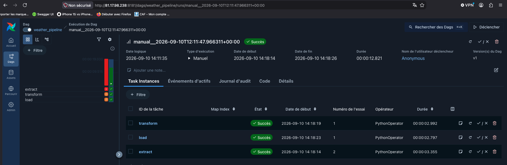
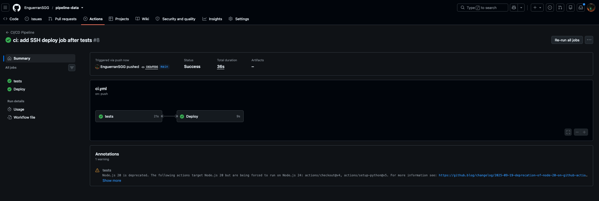

# Rapport d’analyse — captures du pipeline ETL Open-Meteo

Ce document présente uniquement les preuves visuelles du pipeline : DAG Airflow, exécutions réussies, déploiement et résultats de validation.

DAG : `weather_pipeline`  
Enchaînement : `extract` → `transform` → `load`  
Planification : `@hourly`

---

## 1. Pipeline et DAG Airflow (local)

Le DAG `weather_pipeline` est chargé dans l’interface Airflow. Il est **actif**, tagué `etl` / `weather`.

- Dernière exécution réussie : **2026-09-10 13:00** (coche verte)
- Prochaine exécution planifiée : **2026-09-10 14:00**
- Historique des runs visible à droite (barres vertes = succès)

---

## 2. Résultat d’une exécution du pipeline

Run planifié `scheduled__2026-09-10T11:00:00+00:00` : état global **Succès**.

| Tâche | Opérateur | État | Début | Durée |
| --- | --- | --- | --- | --- |
| `extract` | PythonOperator | Succès | 13:00:01 | 1,401 s |
| `transform` | PythonOperator | Succès | 13:00:03 | 0,306 s |
| `load` | PythonOperator | Succès | 13:00:04 | 0,492 s |

Durée totale du DAG : **4,290 s**. Les trois étapes ETL se sont enchaînées sans échec.

---

## 3. DAG déployé sur la VM

Même interface, exposée sur la VM Ubuntu partagée : `http://81.17.94.238:8181/dags`.

Le DAG `weather_pipeline` est listé et **actif** (interrupteur à droite). Le port hôte **8181** correspond au mapping `8181:8080` (Jenkins conserve le 8080).

Run manuel sur la VM `manual__2026-09-10T12:11:47.966331+00:00` : état global **Succès** (durée **12,821 s**).

Le graphe à gauche confirme l’ordre `extract` → `transform` → `load`, toutes les tâches au vert. `extract` est au try n°2 ; `transform` et `load` au try n°1.

---

## 4. Résultat CI/CD

Workflow GitHub Actions `CI Pipeline`, run `ci: add GitHub Actions pytest workflow #2`.

Job **tests** : **succès** en 21 s (checkout, Python, dépendances, `pytest`).

Chaîne complète **CI/CD Pipeline**, run `ci: add SSH deploy job after tests #8`, déclenché par un push sur `main`.

- Statut global : **Success** (36 s)
- Job **tests** : succès (21 s)
- Job **Deploy** : succès (9 s), exécuté après les tests

